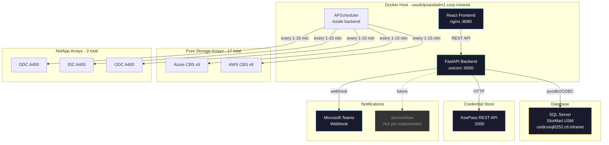
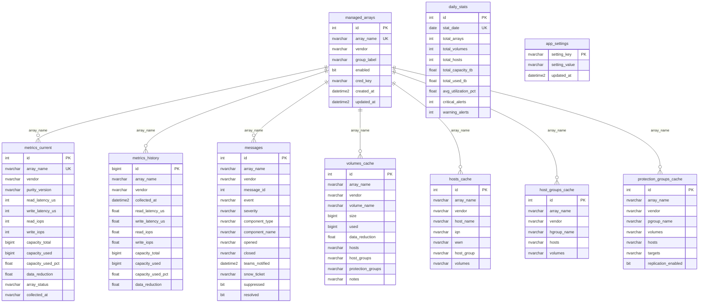

# Unified Storage Monitoring (USM) v2 — Project Tracker

> **Last updated:** 2026-04-24  
> **Live server:** `http://usodclpsandadm1.corp.intranet` (`:8000` API, `:8080` UI)  
> **Status:** Production — actively collecting from 20 arrays

---

## 1. Current State Summary

### Fleet at a Glance

| Metric | Value |
|--------|-------|
| Total arrays | 20 (17 Pure + 3 NetApp) |
| Total capacity | 1,499 TB |
| Total used | 511 TB (31.3% avg) |
| Total IOPS | 48,420 |
| Avg read latency | 1,744 us |
| Avg write latency | 1,155 us |
| Total volumes | 1,379 |
| Total hosts | 409 |
| Active alerts | 169,892 |

### Arrays Breakdown

| Vendor | Arrays | Group | Status |
|--------|--------|-------|--------|
| Pure Storage | 7 | Azure CBS | All OK/healthy |
| Pure Storage | 8 | AWS CBS | All OK/healthy |
| Pure Storage | 2 | Azure CBS (new: eus2-08, eus2-09) | Healthy |
| NetApp ONTAP A400 | 3 | On-prem (DDC, IDC, ODC) | All showing "degraded" |

### Collector Jobs — All Running

| Job | Interval | Arrays | Last Status |
|-----|----------|--------|-------------|
| pure_metrics | 1 min | 17/17 success | OK |
| pure_volumes | 15 min | 17/17 success | OK |
| pure_alerts | 5 min | 17/17 success | OK |
| netapp_metrics | 1 min | 3/3 success | OK |
| netapp_volumes | 15 min | 3/3 success | OK |
| netapp_alerts | 5 min | 3/3 success | OK — but slow at 60s |
| daily_stats | cron 00:05 | — | Scheduled |
| history_cleanup | cron 01:00 | — | Scheduled |

---

## 2. What Is Built (Complete)

### Backend — FastAPI + Python

| Component | File/Path | Status |
|-----------|-----------|--------|
| FastAPI app entry point | `backend/app/main.py` | DONE |
| Pydantic settings | `backend/app/core/config.py` | DONE |
| Custom exceptions | `backend/app/core/exceptions.py` | DONE |
| Security/JWT scaffolding | `backend/app/core/security.py` | DONE (not enforced) |
| DB session + pyodbc pool | `backend/app/db/session.py` | DONE |
| Schema auto-init + migrations | `backend/app/db/session.py` | DONE |
| API v1 router | `backend/app/api/v1/router.py` | DONE |
| Arrays endpoints | `backend/app/api/v1/arrays.py` | DONE |
| Volumes endpoints | `backend/app/api/v1/volumes.py` | DONE |
| Hosts endpoints | `backend/app/api/v1/hosts.py` | DONE |
| Alerts endpoints | `backend/app/api/v1/alerts.py` | DONE |
| Analytics endpoints | `backend/app/api/v1/analytics.py` | DONE |
| Scheduler endpoints | `backend/app/api/v1/scheduler.py` | DONE |
| Settings endpoints | `backend/app/api/v1/settings.py` | DONE |
| API dependencies | `backend/app/api/deps.py` | DONE |
| Pydantic schemas (all) | `backend/app/schemas/` | DONE |
| KeePass service | `backend/app/services/keepass.py` | DONE |
| Teams notification service | `backend/app/services/notification.py` | DONE |
| Stats service | `backend/app/services/stats.py` | DONE |

### Collectors — Plugin Architecture

| Component | File/Path | Status |
|-----------|-----------|--------|
| Base collector ABC | `backend/app/collectors/base.py` | DONE |
| Collector registry + auto-discovery | `backend/app/collectors/registry.py` | DONE |
| APScheduler integration | `backend/app/collectors/scheduler.py` | DONE |
| Pure Storage client | `backend/app/collectors/pure/client.py` | DONE |
| Pure metrics collector | `backend/app/collectors/pure/metrics.py` | DONE |
| Pure volumes collector | `backend/app/collectors/pure/volumes.py` | DONE |
| Pure alerts collector | `backend/app/collectors/pure/alerts.py` | DONE |
| NetApp ONTAP client | `backend/app/collectors/netapp/client.py` | DONE |
| NetApp metrics collector | `backend/app/collectors/netapp/metrics.py` | DONE |
| NetApp volumes collector | `backend/app/collectors/netapp/volumes.py` | DONE |
| NetApp alerts collector | `backend/app/collectors/netapp/alerts.py` | DONE |

### Database Schema (SQL Server — StorMart.USM)

| Table | Purpose | Status |
|-------|---------|--------|
| messages | Alert history + notification tracking | DONE |
| metrics_current | Latest snapshot per array | DONE |
| metrics_history | Time-series data for analytics | DONE |
| daily_stats | Aggregated daily summary | DONE |
| volumes_cache | Volume inventory | DONE |
| hosts_cache | Host inventory | DONE |
| host_groups_cache | Host group inventory | DONE |
| protection_groups_cache | Replication/protection groups | DONE |
| managed_arrays | Array inventory (Settings UI) | DONE |
| app_settings | Key/value runtime config store | DONE |
| Indexes (7 total) | Performance indexes on key queries | DONE |
| Vendor column migrations | Added vendor to all tables for multi-vendor | DONE |

### Frontend — React + TypeScript + Tailwind

| Component | File/Path | Status |
|-----------|-----------|--------|
| App routing | `frontend/src/App.tsx` | DONE |
| Layout shell | `frontend/src/components/layout/Layout.tsx` | DONE |
| Navbar | `frontend/src/components/layout/Navbar.tsx` | DONE |
| Sidebar | `frontend/src/components/layout/Sidebar.tsx` | DONE |
| Dashboard page (inline components) | `frontend/src/pages/Dashboard.tsx` | DONE (472 lines) |
| Volumes page | `frontend/src/pages/Volumes.tsx` | DONE (458 lines) |
| Hosts page | `frontend/src/pages/Hosts.tsx` | DONE |
| Alerts page | `frontend/src/pages/Alerts.tsx` | DONE |
| Analytics page | `frontend/src/pages/Analytics.tsx` | DONE |
| Settings page (6 tabs) | `frontend/src/pages/Settings.tsx` | DONE (691 lines) |
| Logs page | `frontend/src/pages/Logs.tsx` | DONE |
| NotFound page | `frontend/src/pages/NotFound.tsx` | DONE |
| API client (axios) | `frontend/src/api/client.ts` | DONE |
| API modules (arrays, volumes, hosts, alerts, settings) | `frontend/src/api/` | DONE |
| API types | `frontend/src/api/types.ts` | DONE |
| Formatters utility | `frontend/src/utils/formatters.ts` | DONE |
| Global styles + Tailwind | `frontend/src/styles/globals.css` | DONE |

### Infrastructure

| Component | File/Path | Status |
|-----------|-----------|--------|
| Docker Compose v2 | `docker/docker-compose.v2.yml` | DONE |
| Backend Dockerfile | `backend/Dockerfile` | DONE |
| Frontend Dockerfile | `frontend/Dockerfile` | DONE |
| Nginx config | `frontend/nginx.conf` | DONE |
| Makefile | `Makefile` | DONE |
| README | `README.md` | DONE |
| .env.example | `.env.example` | DONE |
| arrays.txt config | `config/arrays.txt` | DONE |

### API Endpoints — 27 Total (All Live)

| Method | Endpoint | Purpose |
|--------|----------|---------|
| GET | /ping | Liveness probe |
| GET | /health | Deep health check |
| GET | /api/v1/arrays/managed | List managed arrays |
| POST | /api/v1/arrays/managed | Add managed array |
| PUT | /api/v1/arrays/managed/{name} | Update managed array |
| DELETE | /api/v1/arrays/managed/{name} | Remove managed array |
| POST | /api/v1/arrays/managed/{name}/verify | Verify array connectivity |
| GET | /api/v1/arrays/fleet-stats | Fleet summary stats |
| GET | /api/v1/arrays | All array metrics |
| GET | /api/v1/arrays/{name} | Single array metrics |
| GET | /api/v1/volumes | Volume inventory |
| PATCH | /api/v1/volumes/notes | Update volume notes |
| GET | /api/v1/hosts | Host inventory |
| GET | /api/v1/hosts/groups | Host groups |
| GET | /api/v1/alerts | Alert history |
| GET | /api/v1/analytics/history/{name} | Array time-series |
| GET | /api/v1/analytics/daily | Daily stats |
| GET | /api/v1/analytics/fleet-history | Fleet-wide history |
| GET | /api/v1/scheduler/status | Job status |
| POST | /api/v1/scheduler/jobs/{id}/run | Trigger job manually |
| POST | /api/v1/scheduler/jobs/{id}/pause | Pause job |
| POST | /api/v1/scheduler/jobs/{id}/resume | Resume job |
| PUT | /api/v1/scheduler/jobs/{id}/interval | Change job interval |
| GET | /api/v1/settings | App settings |
| PUT | /api/v1/settings/notifications | Update notification config |
| POST | /api/v1/settings/notifications/test | Send test notification |
| GET | /api/v1/settings/database | DB table info |
| GET | /api/v1/settings/logs | Backend log tail |

---

## 3. Known Issues & Bugs

| ID | Severity | Description | Details |
|----|----------|-------------|---------|
| BUG-01 | Medium | NetApp arrays show "degraded" status | All 3 NetApp A400 clusters report `array_status: degraded`. Likely a mapping issue in `NetAppMetricsCollector.collect()` — need to verify how ONTAP health status maps to USM status values |
| BUG-02 | Low | NetApp alerts collector is slow | Takes ~60s per cycle vs Pure at ~2.7s. EMS event log pagination is likely fetching too many historical events. Need time-window filtering |
| BUG-03 | Low | `config/arrays.txt` out of sync with DB | File has 14 Pure arrays, no NetApp. DB `managed_arrays` table has 20 arrays (17 Pure + 3 NetApp). File is only used as fallback but should match or be deprecated |
| BUG-04 | Low | Alert count is extremely high | 169,892 active alerts — likely includes all historical NetApp EMS events that were never resolved. Need alert lifecycle management (auto-resolve, TTL, severity filtering) |

---

## 4. Gaps — Architecture Doc vs Reality

### Phase 1-2 Gaps (Backend + Frontend)

| ID | Gap | Architecture Doc Says | Reality | Priority |
|----|-----|----------------------|---------|----------|
| GAP-01 | Reusable frontend components | `components/ui/`, `components/arrays/`, `components/charts/`, `components/common/` should have Button, Card, Modal, Table, DataTable, Pagination, SearchBar, StatusDot, CapacityBar, ArrayCard, ArrayTable, charts, etc. | All directories are empty. Components are inlined in page files (Dashboard 472 lines, Settings 691 lines, Volumes 458 lines) | Medium |
| GAP-02 | Custom hooks | `hooks/useAuth.ts`, `useArrays.ts`, `useVolumes.ts`, `useAlerts.ts`, `useWebSocket.ts`, `useLocalStorage.ts` | `frontend/src/hooks/` directory is empty. Pages use `@tanstack/react-query` directly inline | Medium |
| GAP-03 | State management stores | `stores/authStore.ts`, `filterStore.ts`, `settingsStore.ts` using Zustand | `frontend/src/stores/` directory is empty. No global state management | Low |
| GAP-04 | TypeScript type modules | `types/array.ts`, `volume.ts`, `host.ts`, `alert.ts`, `index.ts` | `frontend/src/types/` directory is empty. Types live in `api/types.ts` only | Low |
| GAP-05 | WebSocket real-time updates | Architecture mentions `api/websocket.py` and `useWebSocket.ts` | Not implemented. All data is polling via react-query | Low |

### Phase 3 Gaps (Authentication)

| ID | Gap | Architecture Doc Says | Reality | Priority |
|----|-----|----------------------|---------|----------|
| GAP-06 | JWT authentication | User model, JWT auth, login/logout/refresh endpoints, protected routes | `security.py` has scaffold code, `config.py` has `SECRET_KEY` + JWT settings. No `auth.py` endpoints, no User model, no login page, no route protection | High (for production) |
| GAP-07 | Login page | `pages/Login.tsx` | Not created | High (for production) |
| GAP-08 | Auth context/store | `AuthContext.tsx` or `authStore.ts` | Not created | High (for production) |

### Phase 4 Gaps (Polish)

| ID | Gap | Architecture Doc Says | Reality | Priority |
|----|-----|----------------------|---------|----------|
| GAP-09 | Tests | `backend/tests/` with conftest, test_auth, test_arrays, etc. | Only `__init__.py` exists — zero tests | Medium |
| GAP-10 | CI/CD pipelines | `.github/workflows/ci.yml`, `deploy.yml` | Not created | Medium |
| GAP-11 | Documentation | `docs/API.md`, `DEPLOYMENT.md`, `DEVELOPMENT.md`, `ARCHITECTURE.md` | Only `README.md` and `USM_v2_Architecture.md` exist (architecture is a planning doc, not post-build docs) | Low |
| GAP-12 | Database migrations | Alembic setup with versioned migrations | Using inline SQL in `session.py init_database()`. Works but not versioned/reversible | Low |
| GAP-13 | Scripts | `scripts/setup.sh`, `migrate.sh`, `backup.sh` | Not created. Makefile covers some of this | Low |

### Infrastructure Gaps

| ID | Gap | Architecture Doc Says | Reality | Priority |
|----|-----|----------------------|---------|----------|
| GAP-14 | ServiceNow integration | SNOW ticketing for critical alerts | `SNOW_ENABLED=false`, placeholder config only, no implementation | Medium |
| GAP-15 | Redis caching | Optional Redis for caching | Not implemented. In-memory caching only (credential cache, arrays cache) | Low |
| GAP-16 | Docker dev overrides | `docker-compose.dev.yml` with hot reload | Only production compose exists | Low |
| GAP-17 | Legacy v1 code cleanup | N/A | Top-level `collectors/`, `scheduler/`, `web/` directories contain old v1 Flask code alongside v2. Should be removed or archived | Low |
| GAP-18 | Separate collectors service | Architecture shows collectors as independent service | Collectors run inside backend process via APScheduler (simpler, works well at current scale) | Not needed |

---

## 5. Improvement Opportunities

| ID | Area | Description | Impact |
|----|------|-------------|--------|
| IMP-01 | NetApp status mapping | Fix degraded status mapping — investigate ONTAP cluster health API response and map correctly to ok/warning/critical | Accuracy |
| IMP-02 | Alert lifecycle | Add auto-resolve for cleared alerts, TTL-based cleanup, severity-based filtering on NetApp EMS events | Reduces 170K alert noise |
| IMP-03 | NetApp alert performance | Add time-window filter to EMS event collection (e.g., last 24h only) to reduce 60s collection time | Performance |
| IMP-04 | Component extraction | Extract inline components from Dashboard, Volumes, Settings pages into reusable modules | Maintainability |
| IMP-05 | Error boundaries | Add React error boundaries to prevent full-page crashes on component errors | Reliability |
| IMP-06 | Loading/error states | Standardize loading spinners and error display across all pages | UX |
| IMP-07 | Export/reporting | Add CSV/PDF export for volumes, hosts, alerts tables | Feature |
| IMP-08 | Dark/light theme toggle | Architecture mentions ThemeContext — currently hard-coded dark theme | UX |
| IMP-09 | Commvault collector | README mentions Commvault as next phase vendor | Feature (future) |
| IMP-10 | Capacity forecasting | Use metrics_history for trend analysis and capacity planning predictions | Feature (future) |

---

## 6. Architecture Diagram

---

## 7. Database Schema Diagram

---

## 8. Technology Stack

| Layer | Technology | Version |
|-------|-----------|---------|
| Backend framework | FastAPI | 0.109+ |
| Backend runtime | Python | 3.11+ |
| Scheduler | APScheduler | AsyncIOScheduler |
| Database | SQL Server | via pyodbc/ODBC 17 |
| Credentials | KeePass REST API | Custom internal |
| Frontend framework | React | 18.x |
| Frontend language | TypeScript | 5.x |
| Build tool | Vite | 5.x |
| CSS framework | Tailwind CSS | 3.4.x |
| Data fetching | TanStack React Query | 5.x |
| Icons | Lucide React | 0.300+ |
| HTTP client | Axios | 1.6.x |
| Charts | Recharts | 2.10.x |
| Containerization | Docker Compose | 3.8 |
| Web server | Nginx | Alpine |
| Notifications | MS Teams Webhooks | MessageCard format |

---

## 9. File Inventory

### Files that exist but are EMPTY or scaffolds only

| Path | Notes |
|------|-------|
| `frontend/src/components/arrays/` | Empty directory — components inlined in pages |
| `frontend/src/components/charts/` | Empty directory — charts inlined in pages |
| `frontend/src/components/common/` | Empty directory |
| `frontend/src/components/ui/` | Empty directory |
| `frontend/src/hooks/` | Empty directory |
| `frontend/src/stores/` | Empty directory |
| `frontend/src/types/` | Empty directory |
| `backend/tests/__init__.py` | Only file in tests — no actual tests |

### Legacy v1 files (candidates for removal)

| Path | Notes |
|------|-------|
| `collectors/` | Old v1 standalone collector package |
| `collectors/common/base.py` | v1 base collector |
| `collectors/common/db.py` | v1 database module |
| `collectors/pure/` | v1 Pure collectors |
| `scheduler/` | v1 scheduler service |
| `scheduler/service.py` | v1 scheduler entry |
| `web/` | v1 Flask web app |
| `web/app.py` | v1 Flask entry point |
| `docker/docker-compose.yml` | v1 compose (kept for reference) |
| `docker/collector.Dockerfile` | v1 collector image |
| `docker/scheduler.Dockerfile` | v1 scheduler image |
| `docker/web.Dockerfile` | v1 web image |
| `docker/requirements/` | v1 per-service requirements |
| `config/jobs.json` | v1 job config |

---

## 10. Suggested Priority Roadmap

### Immediate — Bug Fixes

- [ ] BUG-01: Fix NetApp degraded status mapping
- [ ] BUG-02: Add time-window filter to NetApp EMS alert collector
- [ ] BUG-04: Implement alert lifecycle (auto-resolve, cleanup old alerts)

### Short Term — Code Quality

- [ ] GAP-01: Extract reusable components from page files
- [ ] GAP-09: Add backend tests (at least collectors + API endpoints)
- [ ] GAP-17: Remove or archive legacy v1 code
- [ ] IMP-04: Refactor Dashboard.tsx, Settings.tsx, Volumes.tsx

### Medium Term — Features

- [ ] GAP-14: ServiceNow integration
- [ ] IMP-07: CSV/PDF export for tables
- [ ] IMP-10: Capacity forecasting from metrics_history
- [ ] GAP-02: Extract custom hooks for data fetching patterns

### Long Term — Production Hardening

- [ ] GAP-06/07/08: JWT authentication + login page + route protection
- [ ] GAP-10: CI/CD pipelines
- [ ] GAP-11: Operational documentation
- [ ] GAP-05: WebSocket real-time updates
- [ ] IMP-09: Commvault collector (next vendor)
