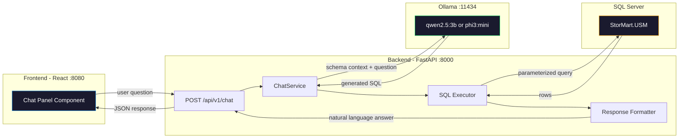
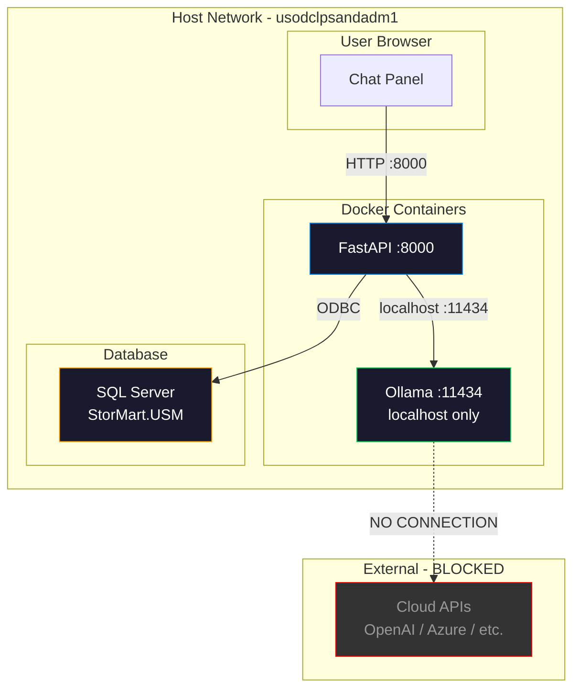

# USM Chat POC — Local AI Storage Assistant

> **Goal:** Natural language Q&A over storage infrastructure data  
> **Constraint:** Zero data leaves the network — all inference runs locally  
> **Approach:** Ollama + small LLM for Text-to-SQL, executed against StorMart DB  
> **Resources:** ~4GB RAM for model, CPU-only inference (~2-5s per response)

---

## 1. Architecture Overview



## 2. How It Works — Step by Step

```
User: "How much storage capacity is being utilized across all arrays?"
                    │
                    ▼
┌─────────────────────────────────────────────────────────┐
│ 1. SYSTEM PROMPT (injected by backend)                  │
│    - DB schema definitions (10 tables)                  │
│    - Column types and descriptions                      │
│    - Example queries for common patterns                │
│    - Safety rules: SELECT only, no mutations            │
│                                                         │
│ 2. USER QUESTION → sent to Ollama                       │
│    "How much storage capacity is utilized?"             │
│                                                         │
│ 3. LLM GENERATES SQL                                   │
│    SELECT                                               │
│      SUM(capacity_total) / 1099511627776.0 AS total_tb, │
│      SUM(capacity_used) / 1099511627776.0 AS used_tb,   │
│      AVG(capacity_used_pct) AS avg_pct                  │
│    FROM USM.metrics_current                             │
│                                                         │
│ 4. SAFETY CHECK                                         │
│    - Validate: is it a SELECT?                          │
│    - Reject: DROP, DELETE, UPDATE, INSERT, EXEC, etc.   │
│    - Reject: system tables, xp_cmdshell, etc.           │
│    - Restrict: only USM schema tables                   │
│                                                         │
│ 5. EXECUTE SQL → get results                            │
│    {total_tb: 1499.16, used_tb: 511.10, avg_pct: 31.3} │
│                                                         │
│ 6. FORMAT RESPONSE (send results back to LLM)           │
│    "Based on current data across 20 arrays:             │
│     Total capacity: 1,499 TB                            │
│     Currently used: 511 TB (31.3% average utilization)  │
│     Available: 988 TB"                                  │
└─────────────────────────────────────────────────────────┘
```

## 3. Security Model — Defense in Depth

| Layer | Protection |
|-------|-----------|
| **Network** | Ollama binds to localhost:11434 only — not exposed externally |
| **Data flow** | User question → local LLM → SQL → local DB → response. Nothing leaves the host |
| **SQL safety** | Whitelist: only SELECT statements allowed. Regex + AST validation |
| **Schema isolation** | Queries restricted to `USM.*` tables only |
| **Dangerous patterns** | Block: DROP, DELETE, UPDATE, INSERT, EXEC, xp_, sp_, OPENROWSET, BULK, etc. |
| **Query timeout** | 10-second max execution time per query |
| **Row limit** | Results capped at 100 rows to prevent data dumps |
| **Read-only connection** | Optional: use a DB user with SELECT-only permissions |
| **No history persistence** | Chat history stays in browser memory only — not stored in DB |

## 4. Example Questions the POC Should Handle

### Capacity & Utilization
- "How much total storage capacity do we have?"
- "Which arrays are over 80% utilized?"
- "Show me capacity breakdown by vendor"
- "What is the average data reduction ratio?"

### Performance
- "Which array has the highest latency right now?"
- "Show me arrays with IOPS over 10000"
- "Compare read vs write latency across all arrays"

### Impact Analysis
- "How many hosts would be affected if purecbs-gp-prod-eus2-02 goes down?"
- "Which volumes are on array X?"
- "Show me hosts connected to array Y"
- "What protection groups cover array Z?"

### Alerts
- "How many critical alerts are open right now?"
- "Show me recent alerts for NetApp arrays"
- "Which arrays have the most alerts?"

### Inventory
- "How many volumes do we have total?"
- "List all arrays by group: azure, aws, on-prem"
- "How many hosts are connected across all arrays?"

## 5. Component Design

### 5a. Ollama Container (Docker)

Added to `docker-compose.v2.yml`:

```yaml
usm-ollama:
  image: ollama/ollama:latest
  container_name: usm-ollama
  network_mode: host
  volumes:
    - ollama-data:/root/.ollama
  environment:
    - OLLAMA_HOST=127.0.0.1:11434
  restart: unless-stopped
  deploy:
    resources:
      limits:
        memory: 6G
```

Model: `qwen2.5:3b` — best balance of size vs SQL generation quality.  
Fallback: `phi3:mini` (3.8B) if Qwen struggles.  
Both run in ~4GB RAM on CPU.

### 5b. Backend — Chat Service

New files:
```
backend/app/api/v1/chat.py          # POST /api/v1/chat endpoint
backend/app/services/chat.py        # ChatService: orchestration
backend/app/services/sql_safety.py  # SQL validation + sanitization
```

**ChatService flow:**
1. Build system prompt with DB schema context
2. Send to Ollama HTTP API (`POST http://localhost:11434/api/generate`)
3. Extract SQL from LLM response
4. Validate SQL safety
5. Execute against DB with timeout
6. Send results back to LLM for natural language formatting
7. Return formatted response

**System prompt template:**
```
You are a storage infrastructure analyst. You help answer questions
about storage arrays, volumes, hosts, and alerts by writing SQL
queries against a SQL Server database.

DATABASE SCHEMA:
- USM.metrics_current: current metrics per array
  Columns: array_name, vendor, capacity_total (bytes),
  capacity_used (bytes), capacity_used_pct, read_iops,
  write_iops, read_latency_us, write_latency_us, ...

- USM.volumes_cache: volume inventory
  Columns: array_name, vendor, volume_name, size (bytes),
  used (bytes), hosts (JSON), host_groups (JSON), ...

[... all 10 tables ...]

RULES:
1. Only write SELECT queries
2. Only query USM.* tables
3. Use TOP 100 to limit results
4. Convert bytes to TB by dividing by 1099511627776.0
5. Return ONLY the SQL query, nothing else

USER QUESTION: {question}
```

### 5c. SQL Safety Validator

```python
BLOCKED_PATTERNS = [
    r'\b(DROP|DELETE|UPDATE|INSERT|ALTER|CREATE|TRUNCATE|EXEC|EXECUTE)\b',
    r'\b(xp_|sp_|OPENROWSET|BULK|BACKUP|RESTORE)\b',
    r'\b(INTO\s+OUTFILE|LOAD_FILE)\b',
    r'--',        # SQL comments (injection vector)
    r';.*\S',     # Multiple statements
]

ALLOWED_TABLES = [
    'USM.metrics_current', 'USM.metrics_history',
    'USM.messages', 'USM.volumes_cache', 'USM.hosts_cache',
    'USM.host_groups_cache', 'USM.protection_groups_cache',
    'USM.managed_arrays', 'USM.daily_stats', 'USM.app_settings',
]
```

### 5d. Frontend — Chat Panel

New files:
```
frontend/src/components/chat/ChatPanel.tsx   # Sliding panel component
frontend/src/components/chat/ChatMessage.tsx # Individual message bubble
frontend/src/api/chat.ts                     # API client for chat
```

**Design:** Floating chat button in bottom-right corner. Clicking opens a slide-out panel. Simple message list + input box. No persistent history.

```
┌────────────────────────────────────┐
│ Storage Assistant            [X]   │
├────────────────────────────────────┤
│                                    │
│  You: How much capacity is used?   │
│                                    │
│  AI: Across 20 arrays, you have    │
│  1,499 TB total capacity with      │
│  511 TB used (31.3% avg).          │
│                                    │
│  The most utilized array is        │
│  purecbs-gp-prod-eus2-02 at 80.3% │
│                                    │
│  You: Which hosts connect to it?   │
│                                    │
│  AI: purecbs-gp-prod-eus2-02 has   │
│  47 connected hosts including:     │
│  - host-prod-sql-01                │
│  - host-prod-app-02                │
│  - ...                             │
│                                    │
├────────────────────────────────────┤
│ [Ask about storage...]    [Send]   │
└────────────────────────────────────┘
```

## 6. API Design

### POST /api/v1/chat

**Request:**
```json
{
  "message": "How much storage capacity is being utilized?",
  "context": []
}
```

`context` is an optional array of previous Q&A pairs for multi-turn conversation (kept in browser memory, sent with each request).

**Response:**
```json
{
  "answer": "Across all 20 arrays, total capacity is 1,499 TB with 511 TB used (31.3% average utilization). The most utilized array is purecbs-gp-prod-eus2-02 at 80.3%.",
  "sql": "SELECT ... FROM USM.metrics_current ...",
  "rows": 20,
  "duration_ms": 2850,
  "model": "qwen2.5:3b"
}
```

The `sql` field is included for transparency/debugging but can be hidden in the UI.

## 7. Data Flow Diagram — Nothing Leaves



## 8. Implementation Checklist

### Infrastructure
- [ ] Add Ollama container to docker-compose.v2.yml
- [ ] Pull qwen2.5:3b model on first startup
- [ ] Configure Ollama to bind localhost only

### Backend
- [ ] Create `backend/app/services/sql_safety.py` — SQL validation
- [ ] Create `backend/app/services/chat.py` — ChatService orchestration
- [ ] Create `backend/app/api/v1/chat.py` — REST endpoint
- [ ] Add chat router to `backend/app/api/v1/router.py`
- [ ] Add Ollama config settings to `backend/app/core/config.py`
- [ ] Add `httpx` or `requests` call to Ollama API

### Frontend
- [ ] Create `frontend/src/components/chat/ChatPanel.tsx`
- [ ] Create `frontend/src/components/chat/ChatMessage.tsx`
- [ ] Create `frontend/src/api/chat.ts`
- [ ] Add floating chat button to Layout.tsx
- [ ] Style chat panel with Tailwind (dark theme matching app)

### Testing & Tuning
- [ ] Test with example questions from Section 4
- [ ] Tune system prompt for SQL accuracy
- [ ] Add 3-5 few-shot examples to system prompt
- [ ] Test safety validator with injection attempts
