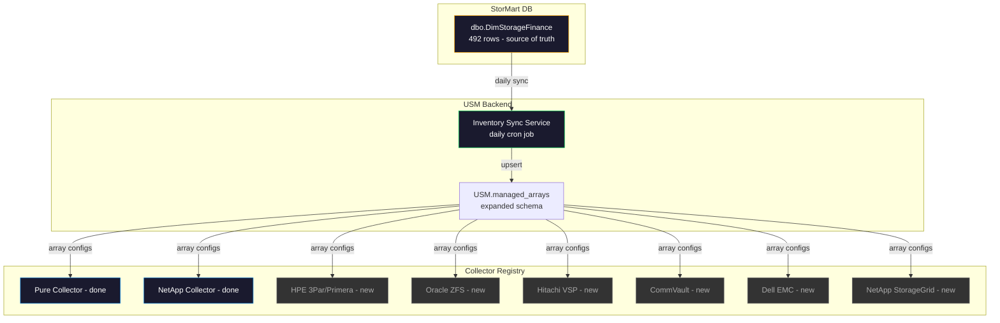

# USM v2 — Storage Array Inventory Integration Plan

> **Source:** StorMart.dbo.DimStorageFinance (492 total rows, 322 active/current)  
> **Goal:** Auto-discover all non-decommissioned arrays, integrate monitoring for supported vendors

---

## 1. DimStorageFinance Discovery Results

### Active Arrays by Vendor (Disposition = Current)

| Vendor | Count | Models | API Support | Priority |
|--------|-------|--------|-------------|----------|
| **CommVault** | 164 | Apollo 4200 G10 | CommVault REST API | Phase 3 |
| **NetApp** | 77 | StorageGrid (65), AFF-A400 (6), CVO (6) | ONTAP REST (A400 done), StorageGrid S3 API | Phase 1 (A400 done, SG new) |
| **HPE** | 23 | 3Par 20450 (11), Primera A670 (9), 3Par 8400 (2), Alletra 9080 (1) | SSMC/WSAPI REST | Phase 2 |
| **PureStorage** | 22 | CBS-V50AR1 (5), FA-X70R4 (5), CBS-V20MP2R2 (4), CBS-V50MP2R2 (3), CBS-V20AR1 (3), XL-130 (2) | Pure REST v1.19 (done) | Phase 1 (done) |
| **Oracle** | 16 | ZS7-2 (12), ZS9-2 (4) | Oracle ZFS REST API | Phase 2 |
| **Dell EMC** | 11 | DD2500 (4), Networker (4), DD6300 (2), UNITY 300 (1) | Dell EMC Unisphere REST | Phase 3 |
| **Hitachi Vantara** | 5 | VSP F900 (5) | Hitachi Ops Center REST | Phase 2 |
| **Veeam** | 3 | Ver. 9.5.4.2866 | Veeam REST API | Phase 3 |
| **Nimble** | 1 | cs3000 | HPE Nimble REST (similar to WSAPI) | Phase 2 |

### Key Columns from DimStorageFinance

| Column | Purpose for USM |
|--------|----------------|
| ArrayNameKey | Short name / identifier |
| ArrayFQDN | Network hostname for API connections |
| ArraySerial | Hardware serial number |
| VendorArrayName | Vendor-prefixed display name |
| Vendor | Vendor classification |
| Model | Hardware model |
| Site | Physical/cloud location (DDC, IDC, ODC, CDC, Cloud-AWS-*, Cloud-AZU-*) |
| Technology | Block, Appliance, Object |
| Category | Primary, Vault, CloudPrimary |
| Usage | General Purpose, Backup, Swing, NSM, Misc |
| Dispostition | Current, Decomming, Decommissioned |
| ActiveRecord | 1 = active, 0 = inactive |
| InstallDate | When installed |
| OEM_EOSL_Date | End of service life |
| MainEndDate | Maintenance end |
| Support | Support provider |
| ArrayIPCTL | Management IP |

### Sites

| Site | Count |
|------|-------|
| DDC (Denver) | ~100 |
| IDC | ~80 |
| ODC | ~60 |
| CDC | ~30 |
| Cloud-AWS-* | ~20 |
| Cloud-AZU-* | ~20 |
| MDC | ~10 |
| WPFL | ~10 |

---

## 2. Architecture — Inventory Sync from DimStorageFinance



---

## 3. DB Schema Changes — Expanded managed_arrays

Current `USM.managed_arrays`:
```
array_name, vendor, group_label, enabled, cred_key, created_at, updated_at
```

Proposed expansion to include DimStorageFinance metadata:
```sql
ALTER TABLE USM.managed_arrays ADD
    array_fqdn       NVARCHAR(255),    -- from ArrayFQDN
    array_serial      NVARCHAR(150),    -- from ArraySerial
    model             NVARCHAR(150),    -- from Model
    site              NVARCHAR(50),     -- from Site
    technology        NVARCHAR(50),     -- from Technology (Block/Appliance/Object)
    category          NVARCHAR(50),     -- from Category (Primary/Vault/CloudPrimary)
    usage_label       NVARCHAR(100),    -- from Usage
    disposition       NVARCHAR(50),     -- from Dispostition (Current/Decomming)
    oem               NVARCHAR(100),    -- from OEM
    support_provider  NVARCHAR(100),    -- from Support
    install_date      DATE,             -- from InstallDate
    eosl_date         DATE,             -- from OEM_EOSL_Date
    maint_end_date    DATE,             -- from MainEndDate
    mgmt_ip           NVARCHAR(50),     -- from ArrayIPCTL
    dim_sync_at       DATETIME2,        -- last sync timestamp
    monitoring_status NVARCHAR(50)      -- 'active', 'no_collector', 'cred_missing', 'unreachable'
```

---

## 4. Credential Mapping Strategy

### Option A: KeePass Key Convention (Recommended)

Map vendor + array name to KeePass keys using naming conventions:

| Vendor | KeePass Key Pattern | Example |
|--------|-------------------|---------|
| PureStorage | `PureStorage_API_{array_name}` | `PureStorage_API_purecbs-gp-prod-eus2-02` |
| NetApp (ONTAP) | `NetApp_{model}_{site}` | `NetApp_A400_DDC` |
| NetApp (StorageGrid) | `NetApp_SG_{site}` | `NetApp_SG_DDC` |
| HPE | `HPE_{model}_{site}` | `HPE_Primera_DDC` |
| Oracle | `Oracle_ZFS_{site}` | `Oracle_ZFS_DDC` |
| Hitachi | `Hitachi_VSP_{site}` | `Hitachi_VSP_DDC` |
| CommVault | `CommVault_{site}` | `CommVault_DDC` |
| Dell EMC | `DellEMC_{model}_{site}` | `DellEMC_DD2500_DDC` |

### Credential Resolution Logic

```python
def resolve_cred_key(array):
    # 1. Explicit cred_key in managed_arrays (manual override)
    if array.cred_key:
        return array.cred_key
    
    # 2. Vendor-specific convention
    if array.vendor == 'PureStorage':
        return f"PureStorage_API_{array.array_name}"
    elif array.vendor == 'NetApp' and array.model == 'AFF-A400':
        return f"NetApp_A400_{array.site}"
    elif array.vendor == 'NetApp' and array.model == 'StorageGrid':
        return f"NetApp_SG_{array.site}"
    elif array.vendor == 'HPE':
        return f"HPE_{array.model.replace(' ', '_')}_{array.site}"
    # ... etc
    
    # 3. Fallback: generic vendor_site
    return f"{array.vendor}_{array.site}"
```

### Manual Override Path
The `cred_key` column in `managed_arrays` allows per-array manual override via the Settings UI. If set, it takes priority over the convention.

---

## 5. Inventory Sync Service Design

New scheduled job: `inventory_sync` — runs daily at 03:00 UTC

```python
async def inventory_sync_job():
    """Sync arrays from DimStorageFinance into USM.managed_arrays."""
    
    # 1. Read all active non-decommissioned arrays from DimStorageFinance
    dim_arrays = query("SELECT * FROM dbo.DimStorageFinance WHERE ActiveRecord = 1 AND Dispostition != 'Decommissioned'")
    
    # 2. Map vendor names to USM vendor codes
    vendor_map = {
        'PureStorage': 'pure',
        'NetApp': 'netapp',
        'HPE': 'hpe',
        'Oracle': 'oracle',
        'Hitachi Vantara': 'hitachi',
        'CommVault': 'commvault',
        'Dell EMC': 'dell',
        'Veeam': 'veeam',
        'Nimble': 'nimble',
    }
    
    # 3. Upsert into managed_arrays (match on array_name)
    for arr in dim_arrays:
        upsert into USM.managed_arrays(
            array_name = arr.ArrayNameKey,
            array_fqdn = arr.ArrayFQDN,
            vendor = vendor_map.get(arr.Vendor, arr.Vendor.lower()),
            model = arr.Model,
            site = arr.Site,
            ...
            dim_sync_at = GETDATE(),
            # Only enable if we have a collector for this vendor
            enabled = vendor in supported_vendors,
        )
    
    # 4. Mark arrays no longer in DimStorageFinance as decommissioned
```

---

## 6. Phased Implementation

### Phase 1 — Inventory Foundation (This Sprint)
- [ ] Expand `managed_arrays` schema with DimStorageFinance columns
- [ ] Build inventory sync service (daily cron)
- [ ] Build credential resolution logic
- [ ] Add inventory management API endpoints
- [ ] Verify Pure + NetApp A400 continue working with expanded schema

### Phase 2 — New Vendor Collectors
- [ ] HPE 3Par/Primera collector (WSAPI)
- [ ] Oracle ZFS collector (REST)
- [ ] Hitachi VSP collector (Ops Center API)
- [ ] NetApp StorageGrid collector (S3/Grid API)
- [ ] Nimble collector (similar to HPE WSAPI)

### Phase 3 — Backup/Appliance Vendors
- [ ] CommVault collector (REST API)
- [ ] Dell EMC Data Domain collector
- [ ] Veeam collector (REST API)

### Phase 4 — UI + Alerting Overhaul
- [ ] Multi-vendor dashboard with vendor filtering
- [ ] Alert rules engine (configurable thresholds)
- [ ] Notification routing (per-vendor, per-severity)
- [ ] Array detail pages with vendor-specific views

---

## 7. Collector API Matrix

| Vendor | API Type | Auth | Metrics | Volumes | Alerts | Port |
|--------|----------|------|---------|---------|--------|------|
| **PureStorage** | REST v1.19 | API token → session | Yes | Yes | Yes | 443 |
| **NetApp ONTAP** | REST (HAL+JSON) | Basic Auth | Yes | Yes | EMS events | 443 |
| **NetApp StorageGrid** | REST | Bearer token | TBD | Buckets | TBD | 443 |
| **HPE 3Par/Primera** | WSAPI REST | Session key | Yes | Yes | Yes | 8080 |
| **Oracle ZFS** | REST | Basic Auth | Yes | Shares/LUNs | Yes | 215 |
| **Hitachi VSP** | Ops Center REST | Bearer token | Yes | Yes | Yes | 443 |
| **CommVault** | REST v4 | Token auth | Jobs/capacity | N/A | Job alerts | 81 |
| **Dell EMC DD** | REST | Basic Auth | Capacity/dedup | Mtrees | Alerts | 443 |
| **Veeam** | REST v1 | Bearer token | Jobs/capacity | N/A | Job alerts | 9419 |
