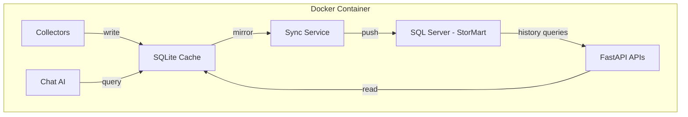

# USM v3.1 — UI Polish & Backend Scaling Plan

## Overview

Nine items across frontend UX, backend fixes, and architecture scaling. Organized into 5 phases.

---

## Phase 1: Dashboard & Tagging (Items 1, 2, 8)

### 1A — Two-Tier Array Tagging

**Current state:** Arrays grouped by `group_label` field — flat list of `aws`, `azure`, `gcp`, `On-Premises`.

**Target:** Two-tier hierarchy on Dashboard:
- **On-Prem** section — all arrays where `group_label` is `On-Premises` or null
- **Cloud** section — subdivided into AWS / Azure / GCP sub-groups

**Approach:** Frontend-only logic change in `Dashboard.tsx`:
- Derive `deployment_type` from existing `group_label`:
  - `group_label` in `[aws, azure, gcp]` → Cloud → sub-grouped by provider
  - `group_label` = `On-Premises` or null → On-Prem
- No backend schema changes needed

**Files:**
- `frontend/src/pages/Dashboard.tsx` — rewrite `GroupSection` to support two-tier nesting

### 1B — Clickable Stat Widgets

**Current state:** `StatCard` components are display-only.

**Target:** Clicking a widget navigates or filters:
| Widget | Action |
|--------|--------|
| Arrays | Scroll to array table |
| Total Capacity | Scroll to array table |
| Used | Scroll to array table |
| Data Reduction | Navigate to /analytics |
| Total IOPS | Navigate to /analytics |
| Avg Latency | Navigate to /analytics |
| Hosts / Volumes | Navigate to /hosts or /volumes |
| Active Alerts | Navigate to /alerts |

**Files:**
- `frontend/src/pages/Dashboard.tsx` — wrap StatCard in clickable containers with `useNavigate`

### 1C — Dashboard Array Table Cleanup

**Current state:** Array table shows all arrays in collapsible group sections. No search/filter.

**Target:** Add a vendor filter dropdown and search box above the array table. Cleaner visual spacing.

**Files:**
- `frontend/src/pages/Dashboard.tsx` — add filter bar above `GroupSection` list

---

## Phase 2: Sortable Tables (Items 3, 4)

### 2A — Volumes Table Sorting

**Current state:** Volumes table has no column sorting.

**Target:** Clickable column headers with sort indicators. Sort columns: Volume, Array, Vendor, Size, Used, Reduction, Snaps.

**Approach:** Add `sortField` + `sortDir` state. Pass as query params to backend API for server-side sorting, or sort client-side within the current page.

**Files:**
- `frontend/src/pages/Volumes.tsx` — add sort state + clickable `<th>` headers
- `backend/app/api/v1/volumes.py` — add `sort_by` and `sort_dir` query params

### 2B — Hosts Table Sorting

Same pattern as Volumes.

**Files:**
- `frontend/src/pages/Hosts.tsx` — add sort state + clickable headers
- `backend/app/api/v1/hosts.py` — add `sort_by` and `sort_dir` query params

### 2C — Alerts Page Overhaul

**Current state:** Alerts has severity filter + resolved toggle but:
- No vendor/array filter
- No pagination — loads ALL alerts at once
- No column sorting

**Target:**
- Add vendor + array filter dropdowns — matching Volumes/Hosts pattern
- Add pagination component — reuse the Pagination from Volumes/Hosts
- Add sortable column headers
- Backend: add `vendor`, `array_name`, `limit`, `offset`, `sort_by`, `sort_dir` params

**Files:**
- `frontend/src/pages/Alerts.tsx` — full rewrite with filters + pagination + sorting
- `backend/app/api/v1/alerts.py` — add filter/pagination params
- `frontend/src/api/alerts.ts` — update API client types

---

## Phase 3: Analytics & Logs Cleanup (Items 5, 6)

### 3A — Analytics Filter Restructure

**Current state:** Filters spread across: time range buttons, vendor dropdown, group dropdown, then a full row of array toggle chips. Looks chaotic with 50+ arrays.

**Target:** Compact filter toolbar:
- Row 1: Time range | Vendor | Group | Search box | Clear button
- Array chips hidden behind a Show Arrays expandable section
- Add a Top N selector — show top 5/10/all arrays by IOPS

**Files:**
- `frontend/src/pages/Analytics.tsx` — restructure filter layout

### 3B — Move Logs to Settings

**Current state:** Logs is a standalone page in Sidebar nav.

**Target:** 
- Move Logs component into Settings as a new tab
- Remove `/logs` route from `App.tsx` — or keep as redirect to `/settings?tab=Logs`
- Remove Logs entry from Sidebar nav

**Files:**
- `frontend/src/pages/Settings.tsx` — add Logs tab, import Logs component
- `frontend/src/components/layout/Sidebar.tsx` — remove Logs nav entry
- `frontend/src/App.tsx` — remove or redirect `/logs` route

---

## Phase 4: Backend Fixes (Items 7, 8)

### 4A — Fix Array Verify for All Vendors

**Current state:** `verify_array` endpoint only handles Pure and NetApp. All other vendors fail silently or fall through to Pure client.

**Target:** Add verification paths for all supported vendors:

```
vendor    client class              auth method           version source
--------  -----------------------   --------------------  ------------------
pure      PureClient                API token             GET /array
netapp    NetAppClient              Basic Auth            GET /cluster
hpe       HPEClient                 Session key           GET /system
hitachi   HitachiClient             Session token         GET /configuration/version
dell      DellUnityClient           Basic Auth + CSRF     GET /basicSystemInfo/instances
oracle    OracleZFSClient           Basic Auth            GET /hardware/v1/chassis
```

**Files:**
- `backend/app/api/v1/arrays.py` — expand `verify_array` with vendor-specific client paths

### 4B — Update Add Array Form

**Current state:** Group dropdown shows free-text options. Doesn't match tagging concept.

**Target:** Replace group field with:
1. **Deployment Type** dropdown: `On-Prem` | `Cloud`
2. **Cloud Provider** dropdown — only shown when Cloud selected: `AWS` | `Azure` | `GCP`

Maps to `group_label` values: `On-Premises`, `aws`, `azure`, `gcp`

**Files:**
- `frontend/src/pages/Settings.tsx` — update `AddArrayModal` and `EditArrayModal`

---

## Phase 5: Backend Architecture — SQLite Read Cache (Item 9)

### Problem Statement

The current architecture has a single SQL Server — `StorMart.USM` — handling ALL reads and writes:
- 7 vendor collectors writing metrics every 5 min, volumes every 30 min, alerts every 10 min
- API endpoints reading metrics, volumes, hosts, alerts for the dashboard
- Chat AI running arbitrary SQL queries
- Host storage report doing batch queries

This caused the `stormart` account lockout and creates contention between writers and readers.

### Proposed Architecture: Write-Through SQLite Cache



**How it works:**
1. **Collectors write to SQLite first** — fast, local, no network latency
2. **API reads from SQLite** — sub-millisecond reads, no SQL Server load
3. **Background sync service** pushes SQLite data to SQL Server every 30-60s
4. **History/analytics queries** still go to SQL Server — long-term time-series data
5. **Chat AI queries SQLite** — eliminates NOLOCK hacks and SQL Server load

### Sync Strategy

| Table | Write to | Read from | Sync interval | Strategy |
|-------|----------|-----------|---------------|----------|
| `metrics_current` | SQLite | SQLite | 30s → SQL Server | Full upsert |
| `volumes_cache` | SQLite | SQLite | 5 min → SQL Server | Full replace per array |
| `hosts_cache` | SQLite | SQLite | 5 min → SQL Server | Full replace per array |
| `messages` | SQLite | SQLite | 60s → SQL Server | Append new, update resolved |
| `metrics_history` | SQL Server direct | SQL Server | N/A — append only | Direct insert, no cache |
| `managed_arrays` | SQL Server | SQL Server + SQLite mirror | 5 min | Read from SQL Server, cache in SQLite |

### Benefits

1. **Eliminates SQL Server lockout risk** — writes are batched, connection count drops from 50+ to 5-10
2. **Enables faster poll rates** — metrics every 60s, alerts every 120s without SQL Server strain
3. **API reads are instant** — SQLite on local disk, no network round-trips
4. **Chat AI runs fast** — queries against local SQLite, no NOLOCK needed
5. **Opens door for host-level metrics** — more data points without impacting SQL Server
6. **Graceful degradation** — if SQL Server goes down, the app keeps running with cached data

### Implementation Files

- `backend/app/db/cache.py` — SQLite connection manager, schema init, read/write helpers
- `backend/app/db/sync.py` — Background sync service: SQLite → SQL Server
- Modify all collector `save()` methods to write to SQLite
- Modify all API endpoints to read from SQLite
- Add SQLite volume mount to `docker/docker-compose.yml`
- Add `aiosqlite` to `requirements.txt`

### Risk Mitigation

- **Data loss on container restart:** Mount SQLite file to host volume
- **Sync lag:** Max 60s — acceptable for monitoring dashboard
- **Conflict resolution:** SQLite is source of truth for current data; SQL Server is source of truth for history

### Decision Needed

This is a significant refactor. Options:
1. **Full implementation** — all tables through SQLite
2. **Incremental** — start with `metrics_current` only, expand later
3. **Read-cache only** — keep writes to SQL Server, add SQLite as read cache populated by a mirror thread
4. **Defer** — focus on UI fixes first, do architecture in v3.2

**Recommendation:** Option 2 — start with `metrics_current` in SQLite. This table gets the most reads and writes. Proves the pattern, then expand.

---

## Execution Order

1. Phase 2C: Alerts page — highest user pain point
2. Phase 2A + 2B: Sortable tables for Volumes + Hosts
3. Phase 1A + 1B: Dashboard tagging + clickable widgets
4. Phase 3B: Logs → Settings
5. Phase 4A: Fix array verify
6. Phase 4B: Update Add Array form
7. Phase 3A: Analytics cleanup
8. Phase 1C: Dashboard filter bar
9. Phase 5: SQLite cache — after UI stabilizes
